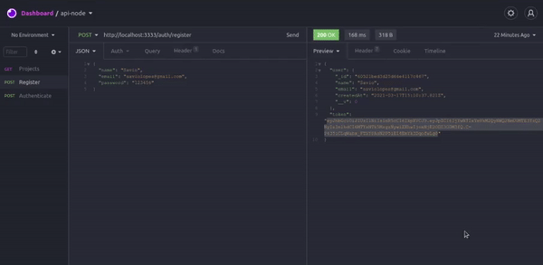

<h3 align="center">
    
</h3>
 
<p align="center"> :computer: <strong>Em progresso ...</strong> 🚧</p>

<p align="center"> 
   
  
 <a href="https://github.com/savio-2-lopes">
    
  </a>
</p>

<br>

## :pushpin: Índice

- [Sobre](#sobre-o-projeto)
- [Progresso](#progresso)
- [Como executar](#executar)
- [Tecnologias](#tecnologia)
- [Licença](#licenca)
- [Agradecimentos](#agradecimento)

<br>

<a id="sobre-o-projeto"></a>

## 💻 Sobre o projeto

:rocket: API Rest utilizando Node.js, Express e o banco de dados MongoDB.

<br>

Baseado nas lives disponibilizadas pela [Rocketseat](https://rocketseat.com.br/) 

<br>

<a id="progresso"></a>

## ⚙️ Progresso

- [x] Estrutura e cadastro
- [x] Autenticação
- [x] Recuperação de senha com NodeMailer

<br>

<a id="executar"></a>

## 🚀 Como executar o projeto

### Pré-requisitos

Antes de começar, você vai precisar ter instalado em sua máquina as seguintes ferramentas:
[Git](https://git-scm.com), [Node.js](https://nodejs.org/en/), [Insomnia](https://insomnia.rest/download), o banco de dados [Mongo](https://www.mongodb.com/) e o gerenciador de pacotes [Yarn](https://yarnpkg.com/).
Além disto é bom ter um editor para trabalhar com o código, como [VSCode](https://code.visualstudio.com/)

<br>

#### 🧭 Rodando a API

```bash

# Primeiramente, verifique se o Mono está ativado em sua máquina
$ sudo systemctl status mongod

# Caso o Mongo não esteja ligado, reinicie
$ sudo systemctl restart mongod

# Após isso, clone este repositório
$ git clone https://github.com/savio-2-lopes/api_node.js.git

# Entre na pasta
$ cd api_node

# Instale as dependências
$ yarn

# Rode o comando
$ yarn start

# E teste a API no Insomnia utilizando a url abaixo
$ http://localhost:3333

```

<br>

<a id="tecnologia"></a>

## 🛠 Tecnologias

As seguintes ferramentas foram usadas na construção do projeto:

- [Node.js](https://nodejs.org/en/)
- [Express](https://expressjs.com/pt-br/)
- [Bcryptjs](https://www.npmjs.com/package/bcryptjs)
- [JsonWebToken](https://github.com/auth0/node-jsonwebtoken)
- [Mongo](https://www.mongodb.com/)

<br>

<a id="licenca"></a>

## :memo: Licença

Este projeto está sob a licença do MIT. Veja a [página de licença](https://opensource.org/licenses/MIT) para mais detalhes.

<br>

<a id="agradecimento"></a>

## 💙 Agradecimentos

Obrigado [Rocketseat](https://rocketseat.com.br/) por disponibilizar esse conteúdo sensacional 🚀.