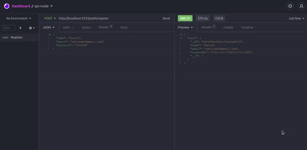

<h3 align="center">
    
</h3>

 :computer: <strong>Em progresso ...</strong> 🚧

 
   
  
  
 
 

 

## :pushpin: Índice

- [Sobre](#sobre-o-projeto)
- [Progresso](#progresso)
- [Tecnologias](#tecnologia)
- [Licença](#licenca)

 

## 💻 Sobre o projeto

:rocket: API Rest utilizando Node.js, Express e o banco de dados Mongo

 

## ⚙️ Progresso

- [x] Estrutura e cadastro
- [ ] Autenticação
- [ ] Recuperação de senha com NodeMailer

 

## 🛠 Tecnologias

As seguintes ferramentas foram usadas na construção do projeto:

- [Node.js](https://nodejs.org/en/)
- [Express](https://expressjs.com/pt-br/)
- [Bcryptjs](https://www.npmjs.com/package/bcryptjs)
- [Mongo](https://www.mongodb.com/)

 

## :memo: Licença

Este projeto está sob a licença do MIT. Veja a [página de licença](https://opensource.org/licenses/MIT) para mais detalhes.
